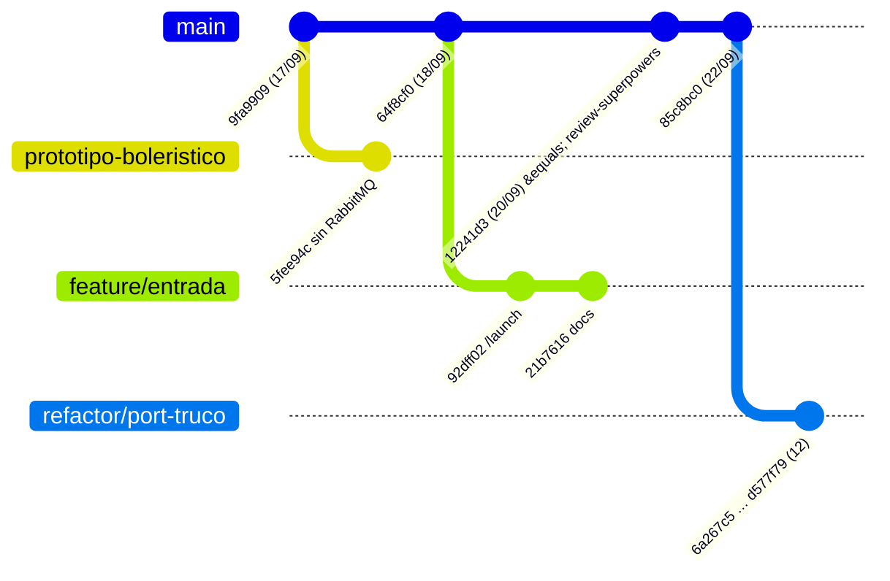

# Ramas de domino-backend-v2

Foto al 24/09/2026. "+N" = commits propios que main no tiene; "atrás" = commits de main que la
rama no tiene.

| Rama | Propios | Atrás | Último commit | Estado |
|---|---|---|---|---|
| `main` | — | — | `85c8bc0` · 22/09 | referencia |
| `refactor/port-truco-integracion-front` | 12 | 0 | `d577f79` · 22/09 | integrable con fast-forward |
| `review-superpowers-fase0-fo` | 0 | 25 | `12241d3` · 20/09 | ya contenida en main |
| `feature/entrada-orquestador-y-matchmaking` | 2 | 27 | `21b7616` · 19/09 | divergente |
| `prototipo-boleristico` | 1 | 38 | `5fee94c` · 17/09 | experimento |



---

## `main`

La línea que vale. Tiene el plan completo (Tareas 0–23), el catálogo de modos con outbox
RabbitMQ, el matchmaking, el torneo y la economía portados de truco, la revancha, el aumento
de apuesta que cobra, y la mesa de cuatro con bot. **1200 tests / 122 archivos.**

---

## `refactor/port-truco-integracion-front` · +12, fast-forward

**Por qué nació:** para portar la tanda de truco del 18 al 22/09 y dejar el dominó listo para
integrarse con el front y con el panel de Betaso.

**Qué trae distinto:**

- **Llaves separadas por dirección** (`a462f76`). Antes había una sola `INTERNAL_API_KEY` para
  las dos direcciones, así que quien tenía la llave del backend también podía mover los plazos
  del juego.
  - `JWT_SECRET` → `BETASO_BACKEND_JWT_SECRET`
  - `BACKEND_URL` → `BETASO_BACKEND_URL`
  - `INTERNAL_API_KEY` → `BETASO_BACKEND_API_KEY` (la presentamos) y
    `BETASO_ADMIN_PANEL_API_KEY` (nos la presentan)
  - El header de entrada pasa a `x-internal-api-key`, como truco y el panel.
- **Plazos editables sin deploy** (`d15efb3`) vía `/internal/settings`. Reiniciar aborta y
  reembolsa las partidas en curso. Una edición llega a la mesa siguiente, nunca a la que está
  abierta.
- **Rutas y salas por feature** (`fdd1528`, `97224b4`). Cada feature expone su Router y su mapa
  de salas, y `app.config` solo los monta.
- **Colyseus 0.18.7** (`6a267c5`). Una sala que falla al nacer ya no emite un `MATCH_ABORTED`
  fantasma (reembolso de una mesa donde nadie se sentó).
- **Caché de 5 s del modo en el tick del matchmaking** (`1bedd37`). Sin él eran 4 lecturas de
  Mongo por segundo por modo con gente en cola. Un apagado cierra la búsqueda con `RESTARTING`.
- La sala registra la config global que fotografió (`bc6341c`).

**Ojo:** rompe el `.env` de cada servidor. Hay que cargar las variables con los nombres nuevos
antes de desplegar.

---

## `review-superpowers-fase0-fo` · 0 propios, ya en main

**Por qué nació:** es la rama del worktree de Orca (`leatherback`), donde se ejecutaron los
planes con agentes: catálogo, reglas, imports con alias `@/`, la mano que apunta jugadas, el
censo del lobby y el sitio VitePress.

**Qué trae distinto:** nada, porque todos sus commits ya están en main. Se puede borrar después
de quitar el worktree.

---

## `feature/entrada-orquestador-y-matchmaking` · +2, 27 atrás

**Por qué nació:** faltaba el camino por el que un jugador entra y consigue rival. No toca
dinero.

```
iframe → POST /launch → canje → JWT del dominó
lobby: FIND_MATCH → cola por modo → dos jugadores → createRoom → MATCH_FOUND
```

**Qué trae distinto** (`92dff02`, feature nueva `src/features/launch/`):

- **El dominó firma su propio JWT** (`JwtSigner`). El token del orquestador es de un solo uso y
  no sirve para cada `join` ni para reconectar.
- **`POST /launch` es idempotente**, con el digest del token como clave. Si el dominó se cae
  entre el canje y su respuesta, el jugador no queda afuera.
- **La recarga reclama el asiento por identidad.** `enqueue` consulta `matchOf` antes de
  encolar, así que quien ya tiene mesa vuelve a la suya.
- **El emparejamiento vive detrás de un puerto** que promete el desenlace, para poder cambiarlo
  después por un matchmaker externo.
- **Catálogo leído del backend principal** (`BetasoCatalogHttpClient`), de solo lectura: con él
  no se registran las rutas que editan.

**Ojo:** main metió después su propio matchmaking portado de truco. La rama choca en
`matchmaking/` y `lobby-room.ts`. Conviene rescatar ideas (idempotencia del launch, el
`JwtSigner`), no mergear.

---

## `prototipo-boleristico` · +1, 38 atrás, experimento

**Por qué nació:** para probar la pregunta de arquitectura *"¿y si el matchmaking lo hace otro
servicio?"*. El orquestador solo marca `buscando=true` en Redis; un matchmaker único ve toda la
pool, empareja y le pide la sala al juego.

**Qué trae distinto** (`5fee94c`):

- `explorations/matchmaking-mvp/`: cinco piezas en docker (orquestador, redis, matchmaker,
  jueguito y panel admin), más `PLAN.md` y `plan.html` con quién escala y quién no.
- Borra RabbitMQ y el outbox del catálogo (−4300 líneas) y recorta el `AGENTS.md`.

**Ojo:** main eligió lo contrario, la entrega durable con RabbitMQ, certificada en el smoke.
Sirve como referencia de diseño. Mergearla deshace trabajo certificado.

---

## Lectura de conjunto

`feature/entrada` y `prototipo-boleristico` resuelven la misma pregunta (cómo entra el jugador y
quién lo empareja) con dos respuestas distintas. Main tomó una tercera, que fue portar el
matchmaking de truco. Ninguna de las dos se mergea directo, pero las dos sirven para diseñar el
orquestador.
