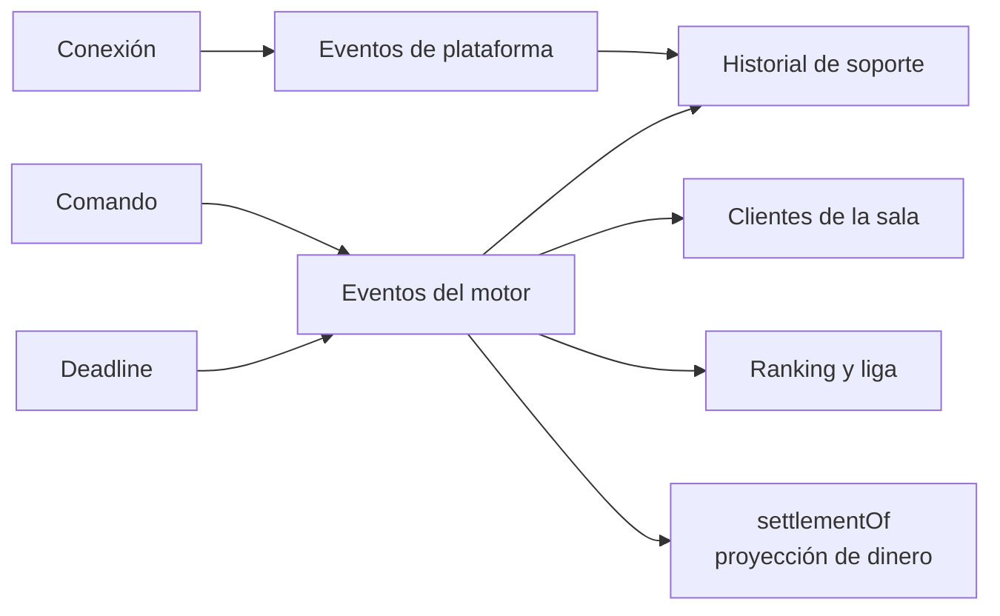

# API HTTP y mensajes

El juego usa WebSocket/Colyseus para la partida y HTTP para configuración, operación y catálogo. No
hay Swagger: los mensajes de sala no son HTTP y los contratos se mantienen tipados en el código.

## Salas Colyseus

| Sala | Quién entra | Estado principal |
|---|---|---|
| `domino` | Participante reservado con JWT válido | Partida, ronda, jugadores, tablero, pozo, turnos y deadlines |
| `lobby` | Cualquier identidad con JWT válido | Contadores, mantenimiento y jugadores conectados al lobby |

El JWT usa `sub` como `userUuid` y lleva `platformId`. La pareja se normaliza con `trim()` y se
compara completa; el UUID solo no identifica un asiento entre plataformas.

## Mensajes de la sala `domino`

| Tipo | Payload del cliente | Efecto |
|---|---|---|
| `REVEAL_TILES` | `{}` | Confirma que el jugador levantó su mano durante `DEALING` |
| `PLAY_TILE` | `{ left, right, side }` | Coloca una ficha legal en `LEFT` o `RIGHT` |
| `DRAW_TILE` | `{}` | Toma del pozo cuando no tiene jugada |
| `PASS` | `{}` | Pasa cuando no puede jugar ni cargar |
| `ABANDON` | `{}` | Abandono voluntario |
| `PROPOSE_BET_MULTIPLIER` | `{ level }` | Congela el turno y abre la negociación |
| `RESPOND_BET_MULTIPLIER` | `{ accept }` | Acepta o rechaza la propuesta vigente |

El cliente no envía `playerId`: el handler lo toma del asiento autenticado. Cada payload pasa por un
decoder estricto antes de alcanzar el comando.

## Estado visible

`StateView` filtra el árbol por cliente:

- Cada jugador ve sus fichas y sólo el conteo de las fichas rivales.
- Nadie ve el contenido del pozo; sí ve cuántas quedan.
- `displayName`, `username` y `profilePicture` son presentación sincronizada.
- `platformId`, `userUuid` y `currency` están en el snapshot del servidor, pero no viajan por wire.
- Las fichas colocadas, el turno, puntajes, fases y deadlines son públicos.

## HTTP público

| Método y ruta | Uso |
|---|---|
| `GET /health` | Liveness del proceso; nunca consulta dependencias |
| `GET /ready` | Readiness; responde `503` y lista dependencias faltantes |
| `GET /config/:roomId` | Config pública de una mesa y `serverNow`; nunca devuelve el seed |
| `GET /game-modes` | Modos activos del catálogo |
| `GET /game-modes/:uuid` | Un modo activo; un modo dado de baja responde 404 |

Todas las respuestas HTTP exponen el header `Date`, que permite recalcular el desfase del reloj del
cliente. `/config/:roomId` agrega `serverNow` para la medición inicial.

## HTTP interno

Estas rutas requieren `X-Internal-Key`. Si `INTERNAL_API_KEY` no existe, no se registran y responden
404: fallan cerradas.

| Método y ruta | Uso |
|---|---|
| `GET /internal/matches/:matchId/history` | Historial ordenado por `seq` para soporte |
| `POST /internal/lobby/maintenance` | Activa o desactiva mantenimiento para mesas nuevas |
| `POST /game-modes` | Crea un modo |
| `PUT /game-modes/:uuid` | Aplica un patch al modo |
| `DELETE /game-modes/:uuid` | Baja lógica |
| `GET /game-modes/reactive/:uuid` | Reactiva; conserva el verbo de v1 por compatibilidad |
| `POST /game-modes/sync` | Encola una republicación completa del catálogo |
| `GET /internal/settings` | Las secciones de config en caliente (`match`, `matchmaking`): en vigor, overrides y editables |
| `GET /internal/settings/:section` | Una sección |
| `PATCH /internal/settings/:section` | Parche de uno o más campos; cotas estrictas, clave desconocida = 400 |
| `DELETE /internal/settings/:section` | Vuelve la sección a los defaults del entorno |

**Config en caliente.** Una edición llega a las mesas que nacen DESPUÉS; una mesa ya abierta conserva
los plazos con los que nació. El proceso que atiende el `PATCH` se refresca en el acto y el resto
del clúster converge en 5 s. Fuera de lo editable quedan `tilesPerPlayer` (regla de juego) y los
tres intervalos que el emparejador lee al arrancar (`tickIntervalMs`, `maintenancePollMs`,
`censusPollMs`): se rechazan con 400 en vez de aceptarse e ignorarse.

## Eventos y salidas

Los eventos de dominio describen consecuencias (`ROUND_RESOLVED`, `MATCH_RESOLVED`, expiraciones).
Los de plataforma describen conexión y aborto. Un comando voluntario ya está en el historial como
comando; no se duplica como evento salvo que exista información nueva.
