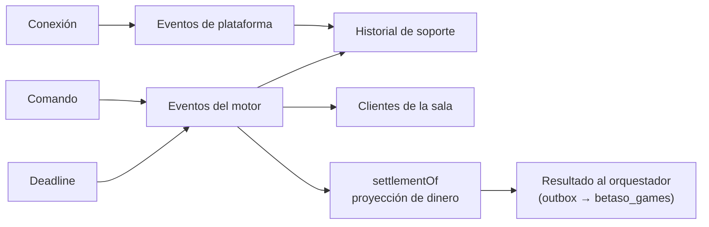

# API HTTP y mensajes

El juego usa WebSocket/Colyseus para la partida y HTTP para configuración, operación, catálogo y la
API del orquestador. No hay Swagger: los mensajes de sala no son HTTP y los contratos se mantienen
tipados en el código.

## Salas Colyseus

| Sala | Quién entra | Estado principal |
|---|---|---|
| `domino` | Participante reservado con JWT válido | Partida, ronda, jugadores, tablero, pozo, turnos y deadlines |

Es la única sala. No hay lobby ni emparejamiento en este servidor: los hace el orquestador, que abre
cada mesa por `POST /internal/matches` y le entrega a cada jugador su reserva de asiento. El jugador
se conecta con esa reserva y su JWT; el `sub` del token es el `userId` con el que el orquestador lo
sentó, normalizado con `trim()`.

## Mensajes de la sala `domino`

| Tipo | Payload del cliente | Efecto |
|---|---|---|
| `REVEAL_TILES` | `{}` | Confirma que el jugador levantó su mano durante `DEALING` |
| `PLAY_TILE` | `{ left, right, side }` | Coloca una ficha legal en `LEFT` o `RIGHT` |
| `DRAW_TILE` | `{}` | Toma del pozo cuando no tiene jugada |
| `PASS` | `{}` | Pasa cuando no puede jugar ni cargar |
| `ABANDON` | `{}` | Abandono voluntario |
| `PROPOSE_BET_MULTIPLIER` | `{ level }` | Congela el turno y abre la negociación |
| `RESPOND_BET_MULTIPLIER` | `{ accept }` | Acepta o rechaza la propuesta vigente |

El cliente no envía `playerId`: el handler lo toma del asiento autenticado. Cada payload pasa por un
decoder estricto antes de alcanzar el comando.

## Estado visible

`StateView` filtra el árbol por cliente:

- Cada jugador ve sus fichas y sólo el conteo de las fichas rivales.
- Nadie ve el contenido del pozo; sí ve cuántas quedan.
- `displayName`, `username` y `profilePicture` son presentación sincronizada.
- `platformId`, `userUuid` y `currency` están en el snapshot del servidor, pero no viajan por wire.
- Las fichas colocadas, el turno, puntajes, fases y deadlines son públicos.

## HTTP público

| Método y ruta | Uso |
|---|---|
| `GET /health` | Liveness del proceso; nunca consulta dependencias |
| `GET /ready` | Readiness; responde `503` y lista dependencias faltantes |
| `GET /config/:roomId` | Config pública de una mesa y `serverNow`; nunca devuelve el seed |
| `GET /matches/:roomId` | La misma config pública, con `Authorization: Bearer <JWT>` |
| `GET /game-modes` | Modos activos del catálogo |
| `GET /game-modes/:uuid` | Un modo activo; un modo dado de baja responde 404 |

Todas las respuestas HTTP exponen el header `Date`, que permite recalcular el desfase del reloj del
cliente. `/config/:roomId` agrega `serverNow` para la medición inicial.

## HTTP interno

Estas rutas requieren el header `x-internal-api-key` con la llave de administración. Si `ADMIN_API_KEY` no existe, no se registran y responden
404: fallan cerradas.

| Método y ruta | Uso |
|---|---|
| `GET /internal/matches/:matchId/history` | Historial ordenado por `seq` para soporte |
| `POST /game-modes` | Crea un modo |
| `PUT /game-modes/:uuid` | Aplica un patch al modo |
| `DELETE /game-modes/:uuid` | Baja lógica |
| `GET /game-modes/reactive/:uuid` | Reactiva; conserva el verbo de v1 por compatibilidad |
| `POST /game-modes/sync` | Encola una republicación completa del catálogo |
| `GET /internal/settings` | Las secciones de config en caliente (`match`; en local y dev también `deal` y `starting-score`): en vigor, overrides y editables |
| `GET /internal/settings/:section` | Una sección |
| `PATCH /internal/settings/:section` | Parche de uno o más campos; cotas estrictas, clave desconocida = 400 |
| `DELETE /internal/settings/:section` | Vuelve la sección a los defaults del entorno |

**Niveles de aumento de un modo.** `POST` y `PUT /game-modes` aceptan `betLevels`:
`[{ level, extra, additionalPoints }]`. `level` es el multiplicador de la entrada y el premio (entero
≥ 2), `extra` se suma al multiplicador de ranking y `additionalPoints` es lo que el ganador suma de
más. Los niveles son únicos y el `extra` crece con el nivel; si no, la respuesta es 400. Sin
`betLevels`, un modo nuevo no ofrece aumentar (`[]`). En el `PUT`, la lista reemplaza a la anterior y
`[]` apaga los aumentos. El `GET` público devuelve `betLevels` ordenados por nivel, y el orquestador los
lee de ahí. Los eventos `game_mode.*` del exchange `betaso` **no** los llevan.

**Config en caliente.** Una edición llega a las mesas que nacen DESPUÉS; una mesa ya abierta conserva
los plazos con los que nació. El proceso que atiende el `PATCH` se refresca en el acto y el resto
del clúster converge en 5 s. Fuera de lo editable queda `tilesPerPlayer` (regla de juego): se rechaza
con 400 en vez de aceptarse e ignorarse.

### API del orquestador

Tres rutas que sólo usa el orquestador de Betaso Juegos, y son la única puerta de entrada a una
partida. Van con `x-internal-api-key` igual a
`ORCHESTRATOR_API_KEY` (`ADMIN_API_KEY` no las abre); sin esa variable no se registran y responden 404.
Un `401 {"error":"UNAUTHORIZED"}` es una llave ausente o equivocada, y se decide ANTES de mirar el
cuerpo.

**`POST /internal/matches`** abre una mesa. Cuerpo (`CreateMatchRequest`, estricto: una clave de más
es 400): `mode` (`"CASUAL"`), `matchId`, `gameModeId` (uuid del catálogo), `participants` (2 a 4;
cada uno `userId`, `displayName`, `currency` y, opcionales, `username` y `profilePicture`), `seed`,
`teamAssignment` (`SHUFFLED` o `SEAT_ORDER`) y `rateId` (opaco: el `_id` de Mongo de la tasa de
Betaso).

| Estado | Cuerpo | Cuándo |
|---|---|---|
| `201` | `{ status, data: { roomId, seats: [{ userId, reservation }] } }` | La sala nació; cada jugador consume su `reservation` |
| `400` | `{ code: "MALFORMED", detail }` | El cuerpo no cumple la forma |
| `401` | `{ error: "UNAUTHORIZED" }` | Llave ausente o equivocada |
| `422` | `{ error: "UNKNOWN_GAME_MODE" }`, `"UNSUPPORTED_GAME_MODE"` o `"SEAT_COUNT_MISMATCH"` | La sala rechazó la mesa: modo inexistente o dado de baja, 4P, o cantidad que no coincide con el modo |
| `500` | | Cualquier otra falla es nuestra |

**`POST /internal/players/:userId/seat`** devuelve el asiento de quien sigue jugando (sin cuerpo).

| Estado | Cuerpo | Cuándo |
|---|---|---|
| `200` | `{ status, data: { matchId, reservation } }` | Sigue en una mesa; el `matchId` es el del orquestador |
| `400` | `{ code: "MALFORMED", detail }` | El `userId` es inválido |
| `401` | `{ error: "UNAUTHORIZED" }` | Llave ausente o equivocada |
| `404` | `{ error: "NO_LIVE_MATCH" }` | No está en ninguna mesa viva |
| `500` | | La sala existe pero `joinById` falló igual (la sala no tiene `maxClients`, así que no debería bloquearse): el orquestador lo trata como desconocido y nunca abre una segunda mesa |

**`GET /internal/census`** cuenta quién está jugando, en todo el clúster: el total y por modo. El
orquestador lo muestra en los números de su lobby.

| Estado | Cuerpo | Cuándo |
|---|---|---|
| `200` | `{ status, data: { playersInMatch, byGameMode: [{ gameModeId, playersInMatch }] } }` | Siempre; un modo sin nadie jugando no aparece |
| `401` | `{ error: "UNAUTHORIZED" }` | Llave ausente o equivocada |

`CreateMatchRequest` acepta además `betLevels` (opcional, `[{ level, extra, additionalPoints }]`):
los niveles de aumento que ofrece la mesa los decide el orquestador, que es quien los cobra.

**Las mesas no mueven dinero: piden que se cobre y dicen qué pasó.** El dominó no tiene billetera,
ni ledger, ni credenciales de ninguna; tampoco reporta ranking ni liga. En cambio:

- **Con la mesa completa**, la sala pide al orquestador `POST {ORCHESTRATOR_URL}internal/matches/:matchId/charges`
  (`x-internal-api-key: ORCHESTRATOR_CALLBACK_API_KEY`) y espera. Con `200` arranca; con cualquier otra
  cosa —un `409`, un orquestador caído, un plazo vencido— se cierra sin arrancar y sale abortada con
  `CHARGE_REJECTED`.
- **Un aumento acordado** se pide igual, `POST …/bets { step, level }`; vale solo con `200`, y si no se
  anula (`MULTIPLIER_REVOKED`).
- **El resultado** sale por un outbox durable al exchange `betaso_games` (broker y vhost de
  `BETASO_GAMES_RABBITMQ_URL`), con `mandatory` y publisher confirm: `domino.match.finished` al
  dictaminarse (participantes, apuesta de la mesa y el premio de `settlementOf`, ya con el aumento) y
  `domino.match.aborted` al cerrarse sin veredicto (sin montos: el orquestador devuelve lo que cobró).
  `messageId = <matchId>:finished|aborted`.

El contrato completo vive en el monorepo del orquestador:
`docs/superpowers/specs/2026-10-05-dinero-mock-resultados-y-reportes-design.md`.

## Eventos y salidas

```mermaid
flowchart LR
  Command["Comando"] --> Domain["Eventos del motor"]
  Timer["Deadline"] --> Domain
  Socket["Conexión"] --> Platform["Eventos de plataforma"]
  Domain --> History["Historial de soporte"]
  Platform --> History
  Domain --> Clients["Clientes de la sala"]
  Domain --> Settlement["settlementOf\nproyección de dinero"]
  Settlement --> Result["Resultado al orquestador\n(outbox → betaso_games)"]
```

Los eventos de dominio describen consecuencias (`ROUND_RESOLVED`, `MATCH_RESOLVED`, expiraciones).
Los de plataforma describen conexión y aborto. Un comando voluntario ya está en el historial como
comando; no se duplica como evento salvo que exista información nueva.
