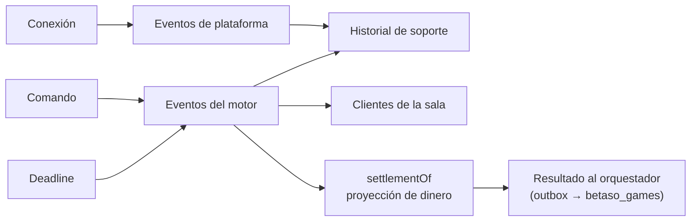

# API HTTP y mensajes

El juego usa WebSocket/Colyseus para la partida y HTTP para configuración, operación, catálogo y la
API del orquestador. No hay Swagger: los mensajes de sala no son HTTP y los contratos se mantienen
tipados en el código.

## Salas Colyseus

| Sala | Quién entra | Estado principal |
|---|---|---|
| `domino` | Participante reservado con JWT válido | Partida, ronda, jugadores, tablero, pozo, turnos y deadlines |

Es la única sala. No hay lobby ni emparejamiento en este servidor: los hace el orquestador, que abre
cada mesa por `POST /internal/matches` y le entrega a cada jugador su reserva de asiento. El jugador
se conecta con esa reserva y su JWT; el `sub` del token es el `userId` con el que el orquestador lo
sentó, normalizado con `trim()`.

## Mensajes de la sala `domino`

| Tipo | Payload del cliente | Efecto |
|---|---|---|
| `REVEAL_TILES` | `{}` | Confirma que el jugador levantó su mano durante `DEALING` |
| `PLAY_TILE` | `{ left, right, side }` | Coloca una ficha legal en `LEFT` o `RIGHT` |
| `DRAW_TILE` | `{}` | Toma del pozo cuando no tiene jugada |
| `PASS` | `{}` | Pasa cuando no puede jugar ni cargar |
| `ABANDON` | `{}` | Abandono voluntario |
| `PROPOSE_BET_MULTIPLIER` | `{ level }` | Congela el turno y abre la negociación |
| `RESPOND_BET_MULTIPLIER` | `{ accept }` | Acepta o rechaza la propuesta vigente |

El cliente no envía `playerId`: el handler lo toma del asiento autenticado. Cada payload pasa por un
decoder estricto antes de alcanzar el comando.

## Estado visible

`StateView` filtra el árbol por cliente:

- Cada jugador ve sus fichas y sólo el conteo de las fichas rivales.
- Nadie ve el contenido del pozo; sí ve cuántas quedan.
- `displayName`, `username` y `profilePicture` son presentación sincronizada.
- `userId` (el `sub` del token) viaja en cada asiento: así el cliente reconoce el suyo con
  `players.find((p) => p.userId === sub)`, también antes de revelar las fichas. Es el último campo de
  `PlayerState`.
- La moneda no es del estado: vive en el `seat` de la config del servidor y no viaja por wire.
- Las fichas colocadas, el turno, puntajes, fases y deadlines son públicos.

## HTTP público

| Método y ruta | Uso |
|---|---|
| `GET /health` | Liveness del proceso; nunca consulta dependencias |
| `GET /ready` | Readiness; responde `503` y lista dependencias faltantes |
| `GET /config/:roomId` | Config pública de una mesa (con `betLevels: [{ level, additionalPoints }]`, vacío si no ofrece aumentar) y `serverNow`; nunca devuelve el seed |
| `GET /matches/:roomId` | La misma config pública, con `Authorization: Bearer <JWT>` |
| `GET /game-modes` | Modos **compartidos** activos del catálogo, con el DTO de siempre (sin dueño ni suscriptores) |
| `GET /game-modes/:uuid` | Un modo compartido activo; uno dado de baja o propio de un operador responde 404 |

Todas las respuestas HTTP exponen el header `Date`, que permite recalcular el desfase del reloj del
cliente. `/config/:roomId` agrega `serverNow` para la medición inicial.

## HTTP interno

Estas rutas requieren una de dos credenciales:

- el header `x-internal-api-key` con la llave de administración (scripts y soporte). Vale como un
  admin de **Betaso Games** con rol `admin`;
- `Authorization: Bearer <token>` con el token de admin que billing-auth emite cuando un admin inicia
  sesión (`POST /v1/admins/login` de billing-auth): ES256, audiencia `betaso-games-admin` y
  `typ: admin`. Sus claims `prv` (el operador del admin; `null` es Betaso Games) y `role` (`admin` o
  `support`) dicen qué abre, y son **obligatorias**: un token sin `prv` (texto o `null` explícito) o
  sin `role` es `401`, igual que un rol desconocido o un `prv` vacío o que no es texto.

Si `ADMIN_API_KEY` no existe, no se registran y responden 404: fallan cerradas.

**Quién entra.** El default es el cerrado: una ruta es de Betaso Games y de escritura salvo que diga
lo contrario. `support` sólo lee. Un admin de **operador** sólo entra a las rutas del catálogo que
acotan su ámbito; en todas las demás recibe `403 {"error":"FORBIDDEN"}`.

| Rutas | Betaso Games `admin` (y la llave) | Betaso Games `support` | Operador `admin` | Operador `support` |
|---|---|---|---|---|
| `/internal/matches…`, `/game-data/:roomId` | sí | sí | 403 | 403 |
| `GET /internal/settings…` | sí | sí | 403 | 403 |
| `PATCH`/`DELETE /internal/settings/:section` | sí | 403 | 403 | 403 |
| `GET /game-modes/admin`, `/admin/:uuid` | todo | todo | los suyos y los compartidos que juega | ídem |
| `POST /game-modes` | compartido o propio de cualquiera | 403 | sólo propio suyo | 403 |
| `PUT`/`DELETE /game-modes/:uuid`, `GET /game-modes/reactive/:uuid` | todo | 403 | sólo los propios suyos | 403 |
| `PUT`/`DELETE /game-modes/:uuid/subscriptions/:providerId` | cualquier operador | 403 | sólo a sí mismo | 403 |
| `POST /game-modes/copy-shared` | para cualquiera | 403 | sólo para sí mismo | 403 |
| `GET /game-modes/catalogs/:providerId` | de cualquiera | de cualquiera | sólo el suyo | sólo el suyo |
| `PUT /game-modes/catalogs/:providerId` | de cualquiera | 403 | sólo el suyo | 403 |

Dentro del catálogo, un modo **propio de otro operador** no existe para un operador: toda operación
sobre él responde `404`. Un modo **compartido** no es secreto (lo lista el catálogo público): tocarlo
sin poder responde `403 {"status":"error","message":…}`.

| Método y ruta | Uso |
|---|---|
| `GET /internal/matches/:matchId/history` | Historial ordenado por `seq` para soporte (lee `timeline` y, en los documentos viejos, `entries`) |
| `GET /internal/matches?pageSize=&after=&from=&to=&matchId=&roomId=&id=&userId=` | Listado de partidas para el panel, la más nueva primero, filtrado y paginado por cursor (ver «El registro de cada partida») |
| `GET /internal/matches/:matchId` | El documento guardado de una partida, entero |
| `GET /game-data/:roomId` | El documento guardado, pelado, para el detalle de movimientos del backend principal |
| `GET /game-modes/admin` | Los modos que ve el admin, dados de baja incluidos |
| `GET /game-modes/admin/:uuid` | Un modo que ve el admin; 404 si no existe o no lo ve |
| `POST /game-modes` | Crea un modo; `ownerProviderId` opcional (ver abajo) |
| `PUT /game-modes/:uuid` | Aplica un patch al modo (el dueño y los suscriptores no se editan acá) |
| `DELETE /game-modes/:uuid` | Baja lógica: escribe sólo `isActive`, los suscriptores se conservan |
| `GET /game-modes/reactive/:uuid` | Reactiva; conserva el verbo de v1 por compatibilidad |
| `PUT /game-modes/:uuid/subscriptions/:providerId` | Suscribe un operador a un compartido activo |
| `DELETE /game-modes/:uuid/subscriptions/:providerId` | Lo da de baja |
| `POST /game-modes/copy-shared` | Copia a modos propios los compartidos a los que un operador está suscrito: `{ providerId }` |
| `GET /game-modes/catalogs/:providerId` | La fuente del catálogo del operador (ver abajo) |
| `PUT /game-modes/catalogs/:providerId` | Cambia la fuente: `{ source: "shared" \| "own" }` |
| `GET /internal/settings` | Las secciones de config en caliente (`match`; en local y dev también `deal` y `starting-score`): en vigor, overrides y editables |
| `GET /internal/settings/:section` | Una sección |
| `PATCH /internal/settings/:section` | Parche de uno o más campos; cotas estrictas, clave desconocida = 400 |
| `DELETE /internal/settings/:section` | Vuelve la sección a los defaults del entorno |

### Modos con dueño y suscripciones

Cada modo tiene un dueño, `ownerProviderId`: `null` es un modo **compartido** de Betaso Games; un id es
un modo **propio** de ese operador, que sólo juegan sus jugadores. Los compartidos llevan además
`subscribers`, los operadores que los juegan:

- **La lista es explícita.** Un compartido se ofrece sólo a los operadores de su lista; un documento
  sin el campo se lee `[]`, igual que un compartido nuevo: no se ofrece a nadie hasta que se
  suscriban. Un modo propio también lleva `[]`: no tiene suscriptores. Los compartidos de antes de las
  suscripciones se suscriben una vez con `npm run modes:subscribe-existing` (`operacion.md`).
- Cada operador se suscribe o se da de baja él mismo (Betaso Games puede hacerlo por cualquiera). La
  suscripción vale sólo sobre compartidos **activos**; sobre uno inactivo o propio, `409`. No hay ruta
  para fijar la lista entera.
- Las escrituras de suscriptores **no avanzan `__v` ni `updatedAt`**: suscribirse no es una edición
  del modo.
- La unicidad (`name + playersQuantity` al crear, `name` al renombrar, con el hueco heredado de v1)
  vale **por dueño**: dos operadores pueden tener cada uno su «Clásica».

Lo que ve cada uno en `GET /game-modes/admin` y `/admin/:uuid`: el DTO de v1 más `ownerProviderId`;
Betaso Games ve también `subscribers`, un operador no (es información de los otros). Un operador ve
sus modos propios y los compartidos con él en la lista; para descubrir un compartido nuevo
al que suscribirse tiene el catálogo público, `GET /game-modes`.

**`POST /game-modes/copy-shared` `{ providerId }`** copia los compartidos **activos** a los que ese
operador está suscrito a modos propios suyos, con los mismos números y niveles. El uuid de cada copia
es determinista (v5 de RFC 4122: espacio = uuid del origen, nombre = `providerId`), así que repetirla
completa una copia a medias sin duplicar y no pisa lo que el operador ya editó. Responde `200`:

```json
{ "status": "success", "data": {
  "created":  [{ "sourceUuid": "…", "uuid": "…" }],
  "existing": [{ "sourceUuid": "…", "uuid": "…" }],
  "skipped":  [{ "sourceUuid": "…", "name": "…", "playersQuantity": 2,
                 "reason": "NAME_TAKEN", "conflictUuid": "…" }] } }
```

`NAME_TAKEN`: el operador ya tenía un modo propio con ese nombre y esa cantidad y otro uuid.
`INVALID_SOURCE_UUID`: el uuid del origen no tiene forma de UUID y no se puede derivar el de la copia.

### La fuente del catálogo de cada operador

Cada operador elige qué catálogo juega, **entero**: `shared` (los compartidos activos a los que está
suscrito) u `own` (sólo sus modos propios activos). Un operador que nunca la cambió está en `shared`.
La guarda el dominó (colección `provider_catalogs`) y la aplica el orquestador al armar el catálogo
efectivo (un operador que juega contra todos usa siempre el compartido, decida lo que decida acá).
El camino habitual para pasar a `own`: `copy-shared`, editar las copias, y recién ahí la fuente.

**`GET /game-modes/catalogs/:providerId`** responde `200`:

```json
{ "status": "success", "data": {
  "providerId": "parley", "source": "own",
  "updatedAt": "2026-10-28T12:00:00.000Z", "updatedBy": "pia" } }
```

(`updatedAt` y `updatedBy` son `null` si nunca se cambió.)

**`PUT /game-modes/catalogs/:providerId` `{ "source": "shared" | "own" }`** responde lo mismo con la
fuente nueva. Pasar a `own` exige **al menos un modo propio activo** del operador: si no, `409`
(quedaría sin lobby). Volver a `shared` siempre se puede. Y al revés: con la fuente en `own`, dar de baja (o
desactivar por `PUT` con `isActive: false`) el **último** modo propio activo del operador es `409`;
primero hay que volver a `shared`. Un operador sólo lee y cambia la suya
(`403` sobre otra); `support` lee y no cambia.

Códigos del catálogo: `400 {code:"MALFORMED"}` forma inválida, `400 {status:"error"}` mesa gratis con
entrada, `403` ámbito, `404` no existe o no lo ve, `409` duplicado o choque de estado (ya inactivo,
propio sin suscriptores, `own` sin modos propios activos), `503` el catálogo está ocupado (otro proceso tiene el lease;
reintentar).

### El registro de cada partida

Cada partida deja **un documento** en `match_history`, con la forma v2.1 de truco (`version: 2.1`). Se
abre al primer reparto (`status: "started"`, con `roomId`, `table`, `matchConfig` —seed y parejas
incluidos—, `seats` y `matchStartedAt`), se alimenta durante la partida (`timeline`, la secuencia de
actos y hechos; `rounds`, lo que las reglas concluyeron de cada mano) y se cierra al terminar
(`status: "finished" | "aborted"`, `matchEndedAt`, `matchDurationInMs`, `matchEndReason`, ganadores,
`players` con su salida y su plata, `rateId`, `betMultiplier` y `rankingMultiplier`). Una mesa que nunca
arrancó nace en el cierre. Los instantes son fechas (ISO en el JSON); las duraciones, números. Los
documentos de antes de la v2.1 (`{ matchId, entries, createdAt, updatedAt }`) se siguen leyendo en las
cuatro rutas.

**`GET /internal/matches`** — el listado del panel, la más nueva primero (`createdAt` descendente y
`_id` de desempate), paginado **por cursor**. Todos los parámetros son opcionales y los filtros se
combinan con AND:

| Parámetro | Qué es | Inválido (400 `MALFORMED`) |
|---|---|---|
| `pageSize` | Filas por página, entero de 1 a 100; default 20 | fuera de rango, no entero |
| `after` | El `nextCursor` de la página anterior, tal cual | cualquier cosa que no sea un cursor emitido por esta ruta |
| `from`, `to` | Instantes ISO 8601 **con hora y zona** (`2026-10-01T00:00:00.000Z`, `…-04:00`): `createdAt >= from` y `createdAt < to` | una fecha sin hora, un instante imposible, `from` posterior a `to` |
| `matchId` | Igual a | vacío, más de 128 caracteres, caracteres de control |
| `roomId` | Igual a | ídem |
| `id` | El `_id` del documento: 24 hexadecimales | otra cosa |
| `userId` | Un jugador: igual al `userId` de **alguno** de los asientos (`seats[].userId`), en mesas de dos o de cuatro. Una partida en la que el mismo usuario ocupa dos asientos sale una vez. Los documentos de antes de la v2.1 no tienen asientos y no coinciden nunca | ídem `matchId`, o repetido |

Un parámetro que no está en la tabla se ignora (`page` incluido: ya no existe). `from` igual a `to` es
un rango vacío, no un error.

```json
{
  "status": "success",
  "data": {
    "items": [
      {
        "_id": "6717a2f0c3bf3e710572f941",
        "matchId": "orq-8f2c",
        "roomId": "ZYIVoz6TQ",
        "game": "domino",
        "status": "finished",
        "table": { "gameModeId": "…", "name": "Clásica 1v1", "entryFeeInUC": 10, "prizeInUC": 18, "isFree": false },
        "createdAt": "2026-10-22T14:00:00.000Z",
        "updatedAt": "2026-10-22T14:09:31.000Z",
        "matchStartedAt": "2026-10-22T14:00:03.000Z",
        "matchEndedAt": "2026-10-22T14:09:00.000Z",
        "matchEndReason": "SCORE",
        "winnerIds": ["seat-1"]
      }
    ],
    "pageSize": 20,
    "nextCursor": "eyJ0IjoxNzkyNjc3NjAwMDAwLCJpZCI6IjY3MTdhMmYwYzNiZjNlNzEwNTcyZjk0MSJ9",
    "total": 1234,
    "totalExact": true
  }
}
```

- **`nextCursor`** es opaco (base64url de `{ t, id }`: el `createdAt` en epoch ms y el `_id` de la última
  fila) y es `null` en la última página. La página siguiente se pide con `after=<nextCursor>` **y los
  mismos filtros**; empieza estrictamente después de esa fila, así que un empate en el mismo
  milisegundo no repite ni pierde filas, y una página honda cuesta lo mismo que la primera.
- **`total`** se cuenta barato: sin filtros es el estimado de la colección (`totalExact: false`); con
  algún filtro se cuenta hasta 10 000 (`totalExact: true`, o `total: 10000` y `totalExact: false` si
  hay más); con `after` no se cuenta (`total: null`, `totalExact: false`).
- **Plazo**: cada consulta tiene 5 s. Si la base no contesta a tiempo:
  `503 { status: "error", message: "La búsqueda tardó demasiado; acota el rango de fechas" }`.

Cada fila es un resumen: sin `timeline` ni `rounds`. Un documento viejo aparece con lo que tiene
(`_id`, `matchId`, `game`, `createdAt`, `updatedAt`) y sale en todo listado que no filtre por sala.

**`GET /internal/matches/:matchId`** — `200 { status: "success", data: <documento> }`, con el `_id`
como texto y `rounds`/`timeline` al final; `404 { status: "error", message: "Partida no encontrada" }`.

**`GET /game-data/:roomId`** — el contrato del backend principal, igual que en truco: `200` con el
documento pelado (sin envelope y sin `_id`) y `404 { error: "MATCH_NOT_FOUND" }`. Busca por `roomId` y,
si no, por `matchId` (los documentos viejos no guardaban la sala).

Las tres van con la llave o el token de admin; sin credencial, `401 { error: "UNAUTHORIZED" }` antes de
mirar la forma. El `POST /internal/matches` del orquestador es otra ruta, con su llave.

**Niveles de aumento de un modo.** `POST` y `PUT /game-modes` aceptan `betLevels`:
`[{ level, extra, additionalPoints }]`. `level` es el multiplicador de la entrada y el premio (entero
≥ 2), `extra` se suma al multiplicador de ranking y `additionalPoints` es lo que el ganador suma de
más. Los niveles son únicos y el `extra` crece con el nivel; si no, la respuesta es 400. Sin
`betLevels`, un modo nuevo no ofrece aumentar (`[]`). En el `PUT`, la lista reemplaza a la anterior y
`[]` apaga los aumentos. El `GET` público devuelve `betLevels` ordenados por nivel, y el orquestador los
lee de ahí (y de `GET /internal/game-modes`).

**Config en caliente.** Una edición llega a las mesas que nacen DESPUÉS; una mesa ya abierta conserva
los plazos con los que nació. El proceso que atiende el `PATCH` se refresca en el acto y el resto
del clúster converge en 5 s. Fuera de lo editable queda `tilesPerPlayer` (regla de juego): se rechaza
con 400 en vez de aceptarse e ignorarse.

### API del orquestador

Cuatro rutas que sólo usa el orquestador de Betaso Juegos; las tres de las mesas son la única puerta
de entrada a una partida. Van con `x-internal-api-key` igual a
`ORCHESTRATOR_API_KEY` (`ADMIN_API_KEY` no las abre); sin esa variable no se registran y responden 404.
Un `401 {"error":"UNAUTHORIZED"}` es una llave ausente o equivocada, y se decide ANTES de mirar el
cuerpo.

**`POST /internal/matches`** abre una mesa. Cuerpo (`CreateMatchRequest`, estricto: una clave de más
es 400): `mode` (`"CASUAL"`), `matchId`, `gameModeId` (uuid del catálogo), `participants` (2 a 4;
cada uno `userId`, `displayName`, `currency` y, opcionales, `username` y `profilePicture`), `seed`,
`teamAssignment` (`SHUFFLED` o `SEAT_ORDER`) y `rateId` (opaco: el `_id` de Mongo de la tasa de
Betaso).

| Estado | Cuerpo | Cuándo |
|---|---|---|
| `201` | `{ status, data: { roomId, seats: [{ userId, reservation }] } }` | La sala nació; cada jugador consume su `reservation` |
| `400` | `{ code: "MALFORMED", detail }` | El cuerpo no cumple la forma |
| `401` | `{ error: "UNAUTHORIZED" }` | Llave ausente o equivocada |
| `422` | `{ error: "UNKNOWN_GAME_MODE" }`, `"UNSUPPORTED_GAME_MODE"` o `"SEAT_COUNT_MISMATCH"` | La sala rechazó la mesa: modo inexistente o dado de baja, 4P, o cantidad que no coincide con el modo |
| `500` | | Cualquier otra falla es nuestra |

**`POST /internal/players/:userId/seat`** devuelve el asiento de quien sigue jugando (sin cuerpo).

| Estado | Cuerpo | Cuándo |
|---|---|---|
| `200` | `{ status, data: { matchId, reservation } }` | Sigue en una mesa; el `matchId` es el del orquestador |
| `400` | `{ code: "MALFORMED", detail }` | El `userId` es inválido |
| `401` | `{ error: "UNAUTHORIZED" }` | Llave ausente o equivocada |
| `404` | `{ error: "NO_LIVE_MATCH" }` | No está en ninguna mesa viva |
| `500` | | La sala existe pero `joinById` falló igual (la sala no tiene `maxClients`, así que no debería bloquearse): el orquestador lo trata como desconocido y nunca abre una segunda mesa |

**`GET /internal/census`** cuenta quién está jugando, en todo el clúster: el total y por modo. El
orquestador lo muestra en los números de su lobby.

| Estado | Cuerpo | Cuándo |
|---|---|---|
| `200` | `{ status, data: { playersInMatch, byGameMode: [{ gameModeId, playersInMatch }] } }` | Siempre; un modo sin nadie jugando no aparece |
| `401` | `{ error: "UNAUTHORIZED" }` | Llave ausente o equivocada |

**`GET /internal/game-modes`** devuelve, en una sola lectura, lo que el orquestador necesita para
armar el catálogo efectivo de cada operador: los modos activos —compartidos y propios— con el DTO de
v1 más `ownerProviderId` y `subscribers` (siempre una lista; `[]` es nadie), y las **fuentes** que se
apartan del default. `?includeInactive=1` suma los dados de baja (para el historial y para que un
operador como Betaso vea las bajas); un valor que no sea `0` o `1` es `400`.

```json
{ "status": "success",
  "data": [ { "_id": "…", "uuid": "…", "name": "Clásica", "multiplier": 1, "prize": 18,
              "entryFee": 10, "playersQuantity": 2, "pointsToWin": 25, "isActive": true,
              "isFreeRoom": false, "enableBots": false, "betLevels": [],
              "createdAt": "…", "updatedAt": "…", "__v": 0,
              "ownerProviderId": null, "subscribers": ["betaso"] } ],
  "catalogs": { "parley": "own" } }
```

`catalogs` es un mapa `providerId → fuente` con **sólo** los operadores que no están en `shared`: un
operador ausente del mapa juega el compartido suscrito. Hoy el único valor posible es `"own"`.

| Estado | Cuerpo | Cuándo |
|---|---|---|
| `200` | `{ status, data: [GameModeDTO & { ownerProviderId, subscribers }], catalogs: { [providerId]: "own" } }` | Siempre |
| `401` | `{ error: "UNAUTHORIZED" }` | Llave ausente o equivocada (la del panel tampoco la abre) |

⚠ **El dominó no verifica el operador al abrir una mesa.** `POST /internal/matches` resuelve el modo
activo por uuid sin mirar su dueño: que un jugador sólo use los modos de su operador lo garantiza el
orquestador.

`CreateMatchRequest` acepta además `betLevels` (opcional, `[{ level, extra, additionalPoints }]`):
los niveles de aumento que ofrece la mesa los decide el orquestador, que es quien los cobra.

**Las mesas no mueven dinero: piden que se cobre y dicen qué pasó.** El dominó no tiene billetera,
ni ledger, ni credenciales de ninguna; tampoco reporta ranking ni liga. En cambio:

- **Con la mesa completa**, la sala pide al orquestador `POST {ORCHESTRATOR_URL}v1/matches/:matchId/charges`
  (`x-internal-api-key: ORCHESTRATOR_CALLBACK_API_KEY`) y espera. Con `200` arranca; con cualquier otra
  cosa —un `409`, un orquestador caído, un plazo vencido— se cierra sin arrancar y sale abortada con
  `CHARGE_REJECTED`.
- **Un aumento acordado** se pide igual, `POST …/bets { step, level }`; vale solo con `200`, y si no se
  anula (`MULTIPLIER_REVOKED`).
- **El resultado** sale por un outbox durable al exchange `betaso_games` (broker y vhost de
  `BETASO_GAMES_RABBITMQ_URL`), con `mandatory` y publisher confirm: `domino.match.finished` al
  dictaminarse (participantes, apuesta de la mesa y el premio de `settlementOf`, ya con el aumento) y
  `domino.match.aborted` al cerrarse sin veredicto (sin montos: el orquestador devuelve lo que cobró).
  `messageId = <matchId>:finished|aborted`.

El contrato completo vive en el monorepo del orquestador:
`docs/superpowers/specs/2026-10-05-dinero-mock-resultados-y-reportes-design.md`.

## Eventos y salidas


```mermaid
flowchart LR
  Command["Comando"] --> Domain["Eventos del motor"]
  Timer["Deadline"] --> Domain
  Socket["Conexión"] --> Platform["Eventos de plataforma"]
  Domain --> History["Historial de soporte"]
  Platform --> History
  Domain --> Clients["Clientes de la sala"]
  Domain --> Settlement["settlementOf\nproyección de dinero"]
  Settlement --> Result["Resultado al orquestador\n(outbox → betaso_games)"]
```

Los eventos de dominio describen consecuencias (`ROUND_STARTED` en cada reparto, `ROUND_RESOLVED`,
`MATCH_RESOLVED`, expiraciones). Los de plataforma describen conexión y aborto. Un comando voluntario
ya está en el historial como comando; no se duplica como evento salvo que exista información nueva.

Detrás de cada `ROUND_STARTED` el historial graba `TILES_DEALT`: las manos y el pozo tal como se
repartieron, leídos del árbol en ese instante. No es un evento (no se difunde a la mesa) y es lo que
soporte tiene cuando la partida se jugó con un reparto preparado y el replay no la reproduce. Cada
entrada lleva la mano en que pasó, tomada de `ROUND_STARTED` y no del árbol.
