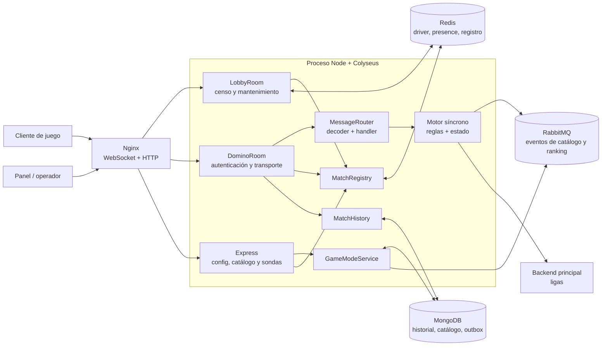
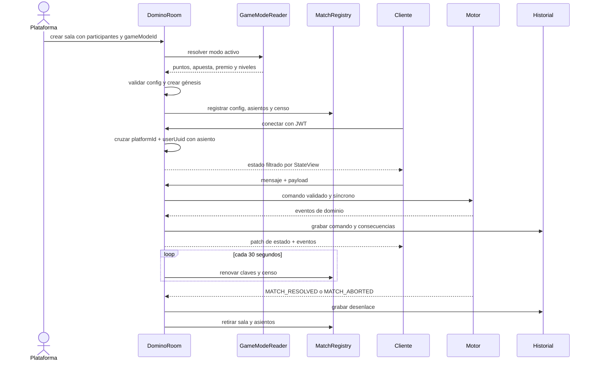
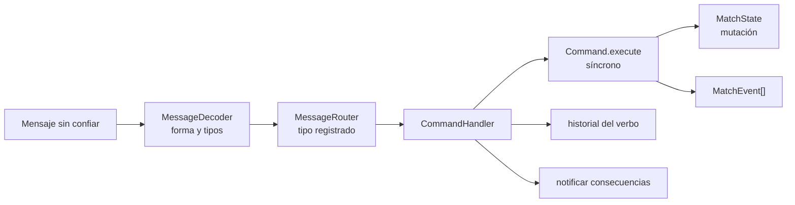
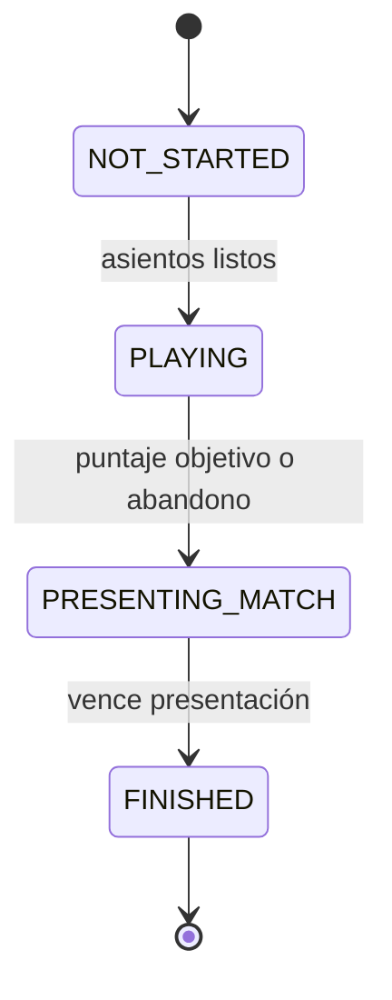
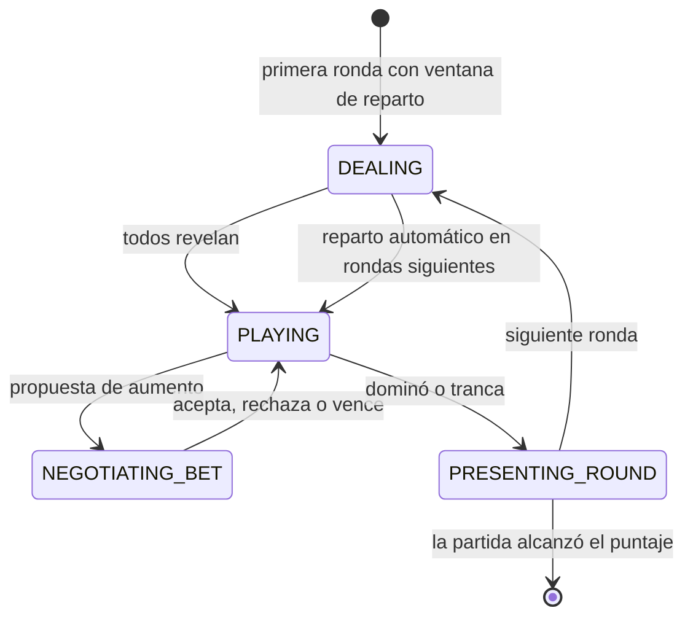

# Arquitectura y flujos

Dominó v2 es un port de la arquitectura de truco, no una copia del juego. Conserva el aislamiento
del motor y la forma de operar un clúster Colyseus, pero las reglas, los comandos y la economía son
los del dominó v1.

## Mapa del sistema

Los procesos no se hablan directamente. Redis hace que sus salas, reservas y registros formen un
solo clúster. Mongo guarda lo que debe sobrevivir a un reinicio. RabbitMQ y el backend principal son
salidas: una partida puede seguir jugando si están temporalmente caídos.

## Las capas

| Capa | Responsabilidad | Regla principal |
|---|---|---|
| `core/rules/` | Consultar legalidad, extremos, puntaje y acciones disponibles | Devuelve datos (`Ruling`); no muta ni lanza |
| `core/engine/` | Ejecutar comandos y mutar el árbol de partida | Síncrono; no espera red |
| `core/state/` | Árbol Colyseus y visibilidad por jugador | Identidad externa y moneda no se sincronizan |
| `network/` | Historial, eventos, standings y proyecciones económicas | Traduce desenlaces; no decide reglas |
| `transports/` | Colyseus, HTTP, Mongo, AMQP | Valida entradas y adapta infraestructura |
| `app.config.ts` / `di-container.ts` | Ensamblar servidor y dependencias del proceso | Las features no resuelven infraestructura por su cuenta |
| `main.ts` | Escuchar y apagar ordenadamente | Salas primero; persistencia después |

El cliente puede reutilizar `core/rules/` sin llevarse Colyseus. `MatchView` es la frontera contra
trampas: una regla recibe únicamente estado público y accede a la mano privada mediante la puerta
explícita del jugador.

## Una partida de principio a fin

### Creación

`DominoRoom.onCreate` rechaza mantenimiento, resuelve el modo del catálogo y convierte opciones no
confiables en un `DominoMatchConfig` congelado. La identidad externa se transforma una sola vez en
asientos opacos (`seat-1`, `seat-2`, …); el motor no conoce plataformas ni UUIDs.

### Conexión y reconexión

El JWT aporta `{ platformId, userUuid }`. Esa pareja debe coincidir con la reserva de la mesa. Un
corte de red marca al jugador desconectado, pero conserva su asiento y su reloj durante la ventana
de reconexión. El censo del lobby cuenta asientos vivos, no sockets momentáneamente conectados.

### Comandos

Router, decoder y handler se registran juntos: no existe un camino desde un mensaje crudo hasta un
comando que salte la validación. El historial pertenece al verbo ejecutado, no al formato del
socket.

## Máquinas de estado

### Partida

### Ronda

Hay un solo `activeDeadline`. Por eso repartir, jugar, negociar una apuesta y presentar el resultado
son fases distintas: cada una espera una clase diferente de input o timeout.

## Datos y degradación

| Componente | Con la dependencia | Sin la dependencia |
|---|---|---|
| Registro de salas y presence | Redis compartido entre procesos | Implementación local de Colyseus; clúster de un proceso |
| `MatchRegistry` y lobby | Redis, TTL y censo compartido | `MemoryKeyValueStore`; válido para una sola instancia |
| Historial | MongoDB, persiste reinicios | `MemoryHistory`, limitado al proceso |
| Catálogo y outbox | MongoDB, escritura durable | Repositorio y outbox de memoria |
| Publicación del outbox | RabbitMQ con confirmaciones | El outbox conserva pendientes si Mongo existe |
| Ranking | RabbitMQ | La partida termina igual; no publica |
| Liga | Backend HTTP | La partida termina igual; no reporta liga |

La presencia de `MONGO_URI`, `REDIS_URL`, `RABBITMQ_URL` y `BACKEND_URL` elige cada capacidad. No
hay variables que nombren drivers.

## Dinero: qué hace y qué no hace

- El modo congela `entryFee`, `prize`, `currency` y `rateId` en el snapshot de la mesa.
- `settlementOf` proyecta instrucciones idempotentes de reembolso o premio; no mueve dinero.
- El aumento de apuesta se negocia en el motor, pero no se cobra todavía.
- Una mesa 4P no se liquida: falta una regla de producto para repartir el premio entre compañeros.
- El orquestador que entregue instrucciones al wallet está diseñado, pero no vive en este backend.

La propuesta del orquestador está en [Orquestador multiplataforma](./orquestador-multiplataforma.md).

## Dónde empezar a leer código

1. `src/features/match/core/rules/`: preguntas puras que también podría hacer el cliente.
2. `src/features/match/core/engine/`: génesis, comandos, conductores y scoring.
3. `src/features/match/transports/colyseus/domino-room.ts`: ciclo de vida de la sala.
4. `src/features/match/transports/colyseus/commands/`: entrada de mensajes.
5. `src/features/match/network/`: historial y efectos hacia la plataforma.
6. `src/features/game-mode/`: catálogo, outbox y publicación.
7. `src/di-container.ts` y `src/app.config.ts`: decisiones de infraestructura.
