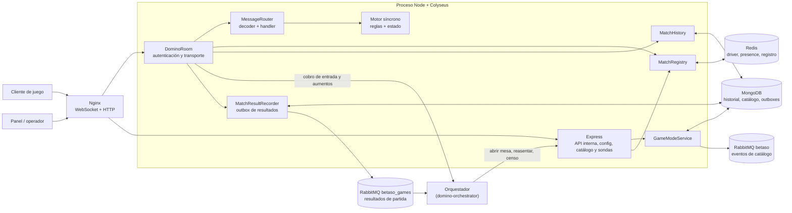
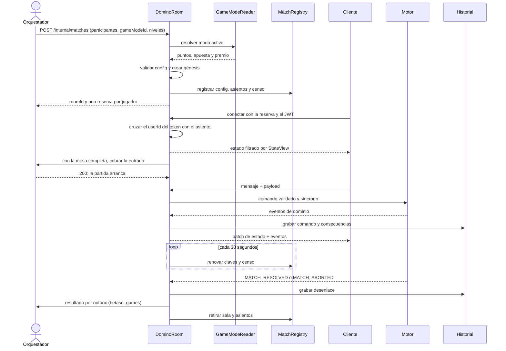
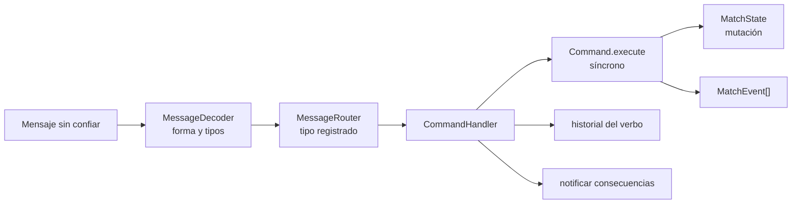
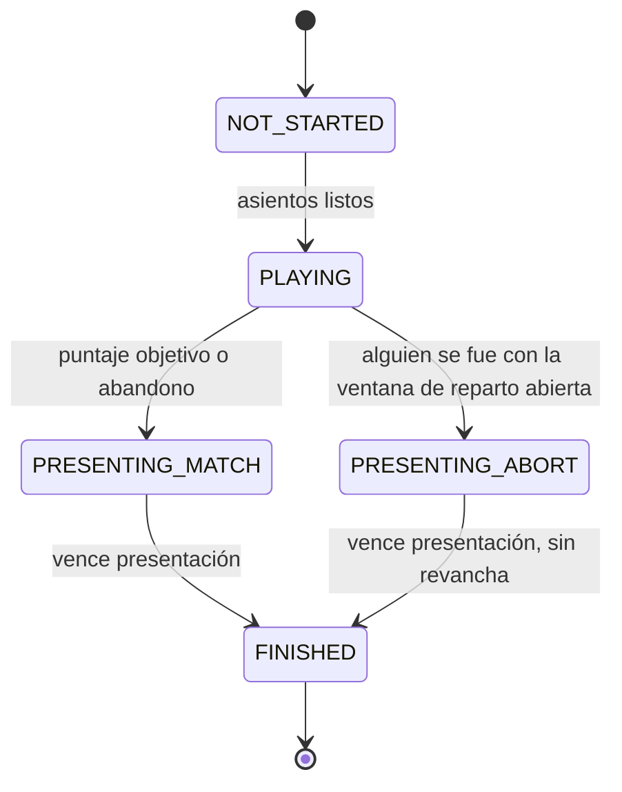
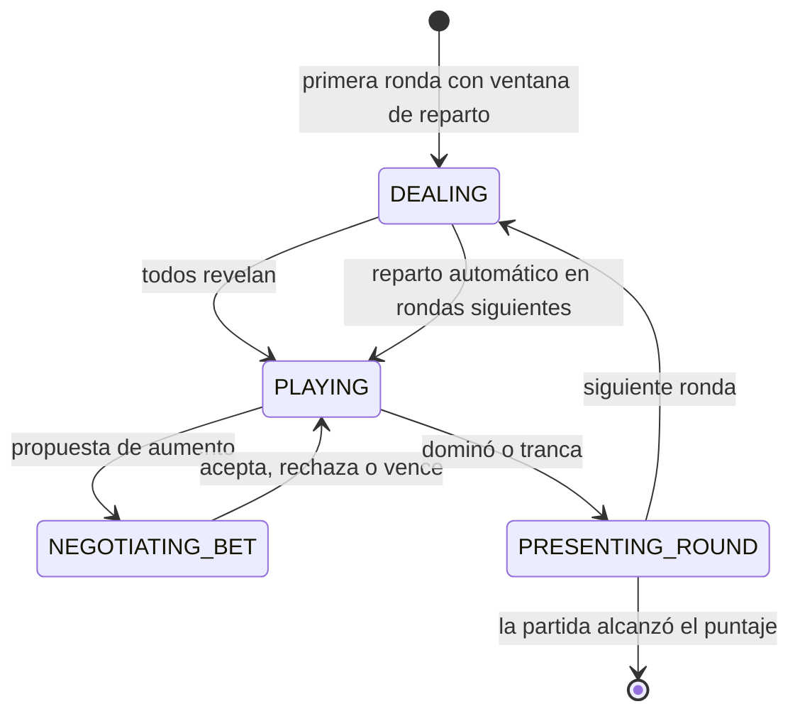

# Arquitectura y flujos

Dominó v2 es un port de la arquitectura de truco, no una copia del juego. Conserva el aislamiento
del motor y la forma de operar un clúster Colyseus, pero las reglas, los comandos y la economía son
los del dominó v1.

Es un **game backend**: juega las mesas que le abre el orquestador de Betaso Juegos
(`betaso-games-orchestrator`, `apps/domino-orchestrator`). El orquestador es la única puerta de
entrada —admite, empareja, tiene el único interruptor de mantenimiento y decide qué se cobra— y el
dominó no mueve dinero: le pide al orquestador que cobre la entrada y cada aumento, y le publica el
resultado de cada partida.

## Mapa del sistema

```mermaid
flowchart LR
  Client["Cliente de juego"]
  Orch["Orquestador\n(domino-orchestrator)"]
  Panel["Panel / operador"]
  Proxy["Nginx\nWebSocket + HTTP"]

  subgraph Process["Proceso Node + Colyseus"]
    Room["DominoRoom\nautenticación y transporte"]
    Router["MessageRouter\ndecoder + handler"]
    Engine["Motor síncrono\nreglas + estado"]
    HTTP["Express\nAPI interna, config, catálogo y sondas"]
    Registry["MatchRegistry"]
    Catalog["GameModeService"]
    History["MatchHistory"]
    Results["MatchResultRecorder\noutbox de resultados"]
  end

  Redis[("Redis\ndriver, presence, registro")]
  Mongo[("MongoDB\nhistorial, catálogo, outboxes")]
  Rabbit[("RabbitMQ betaso\neventos de catálogo")]
  Games[("RabbitMQ betaso_games\nresultados de partida")]

  Client --> Proxy
  Panel --> Proxy
  Orch -->|"abrir mesa, reasentar, censo"| HTTP
  Proxy --> Room
  Proxy --> HTTP
  Room --> Router --> Engine
  Room --> Registry
  Room --> History
  Room -->|"cobro de entrada y aumentos"| Orch
  Room --> Results
  HTTP --> Catalog
  HTTP --> Registry
  Registry <--> Redis
  History <--> Mongo
  Catalog <--> Mongo
  Results <--> Mongo
  Catalog --> Rabbit
  Results --> Games
  Games --> Orch
```

Los procesos no se hablan directamente. Redis hace que sus salas, reservas y registros formen un
solo clúster. Mongo guarda lo que debe sobrevivir a un reinicio. Los dos brokers son salidas con
outbox: una partida puede seguir jugando si están temporalmente caídos.

## Las capas

| Capa | Responsabilidad | Regla principal |
|---|---|---|
| `core/rules/` | Consultar legalidad, extremos, puntaje y acciones disponibles | Devuelve datos (`Ruling`); no muta ni lanza |
| `core/engine/` | Ejecutar comandos y mutar el árbol de partida | Síncrono; no espera red |
| `core/state/` | Árbol Colyseus y visibilidad por jugador | Identidad externa y moneda no se sincronizan |
| `network/` | Historial, eventos, cobros al orquestador, resultado y proyección económica | Traduce desenlaces; no decide reglas |
| `transports/` | Colyseus, HTTP, Mongo, AMQP | Valida entradas y adapta infraestructura |
| `app.config.ts` / `di-container.ts` | Ensamblar servidor y dependencias del proceso | Las features no resuelven infraestructura por su cuenta |
| `main.ts` | Escuchar y apagar ordenadamente | Salas primero; persistencia después |

El cliente puede reutilizar `core/rules/` sin llevarse Colyseus. `MatchView` es la frontera contra
trampas: una regla recibe únicamente estado público y accede a la mano privada mediante la puerta
explícita del jugador.

## Una partida de principio a fin

```mermaid
sequenceDiagram
  actor Orch as Orquestador
  participant Room as DominoRoom
  participant Modes as GameModeReader
  participant Registry as MatchRegistry
  participant Player as Cliente
  participant Engine as Motor
  participant History as Historial

  Orch->>Room: POST /internal/matches (participantes, gameModeId, niveles)
  Room->>Modes: resolver modo activo
  Modes-->>Room: puntos, apuesta y premio
  Room->>Room: validar config y crear génesis
  Room->>Registry: registrar config, asientos y censo
  Room-->>Orch: roomId y una reserva por jugador

  Player->>Room: conectar con la reserva y el JWT
  Room->>Room: cruzar el userId del token con el asiento
  Room-->>Player: estado filtrado por StateView
  Room->>Orch: con la mesa completa, cobrar la entrada
  Orch-->>Room: 200: la partida arranca

  Player->>Room: mensaje + payload
  Room->>Engine: comando validado y síncrono
  Engine-->>Room: eventos de dominio
  Room->>History: grabar comando y consecuencias
  Room-->>Player: patch de estado + eventos

  loop cada 30 segundos
    Room->>Registry: renovar claves y censo
  end

  Engine-->>Room: MATCH_RESOLVED o MATCH_ABORTED
  Room->>History: grabar desenlace
  Room->>Orch: resultado por outbox (betaso_games)
  Room->>Registry: retirar sala y asientos
```

### Creación

La única forma de abrir una mesa es `POST /internal/matches`, que llama el orquestador. Si hay
mantenimiento, el orquestador no abre mesas: el dominó no tiene interruptor propio.
`DominoRoom.onCreate` valida el pedido (`requestOf`), resuelve el modo del catálogo y lo convierte en
un `DominoMatchConfig` congelado. La identidad externa se transforma una sola vez en asientos opacos
(`seat-1`, `seat-2`, …); el motor no conoce plataformas ni UUIDs.

La partida arranca recién cuando el orquestador confirma el cobro de la entrada a todos. Si no lo
confirma, la mesa se cierra sin arrancar y sale abortada con `CHARGE_REJECTED`.

### Conexión y reconexión

El `sub` del JWT es el `userId` y debe coincidir con un asiento de la mesa. Un corte de red marca al
jugador desconectado, pero conserva su asiento y su reloj durante la ventana de reconexión; si el
cliente perdió la reserva, el orquestador le pide una nueva (`POST /internal/players/:userId/seat`).
El censo (`GET /internal/census`) cuenta asientos vivos, no sockets momentáneamente conectados.

### Comandos

```mermaid
flowchart LR
  Raw["Mensaje sin confiar"] --> Decoder["MessageDecoder\nforma y tipos"]
  Decoder --> Router["MessageRouter\ntipo registrado"]
  Router --> Handler["CommandHandler"]
  Handler --> Command["Command.execute\nsíncrono"]
  Command --> State["MatchState\nmutación"]
  Command --> Events["MatchEvent[]"]
  Handler --> History["historial del verbo"]
  Handler --> Notify["notificar consecuencias"]
```

Router, decoder y handler se registran juntos: no existe un camino desde un mensaje crudo hasta un
comando que salte la validación. El historial pertenece al verbo ejecutado, no al formato del
socket.

## Máquinas de estado

### Partida

```mermaid
stateDiagram-v2
  [*] --> NOT_STARTED
  NOT_STARTED --> PLAYING: asientos listos
  PLAYING --> PRESENTING_MATCH: puntaje objetivo o abandono
  PLAYING --> PRESENTING_ABORT: alguien se fue con la ventana de reparto abierta
  PRESENTING_MATCH --> FINISHED: vence presentación
  PRESENTING_ABORT --> FINISHED: vence presentación, sin revancha
  FINISHED --> [*]
```

Irse con la ventana de reparto abierta **anula** la partida, como en v1 (`isGameValid()`): no gana
nadie, la sala aborta con `TILES_NOT_SEEN` y se reembolsa a todos menos al que se fue habiendo
levantado sus fichas. La meta alcanzada le gana a cualquier forfeit: el ganador que se retira en la
pausa de la mano decisiva no pierde la partida.

### Ronda

```mermaid
stateDiagram-v2
  [*] --> DEALING: primera ronda con ventana de reparto
  DEALING --> PLAYING: todos revelan
  DEALING --> PLAYING: reparto automático en rondas siguientes
  PLAYING --> NEGOTIATING_BET: propuesta de aumento
  NEGOTIATING_BET --> PLAYING: acepta, rechaza o vence
  PLAYING --> PRESENTING_ROUND: dominó o tranca
  PRESENTING_ROUND --> DEALING: siguiente ronda
  PRESENTING_ROUND --> [*]: la partida alcanzó el puntaje
```

Hay un solo `activeDeadline`. Por eso repartir, jugar, negociar una apuesta y presentar el resultado
son fases distintas: cada una espera una clase diferente de input o timeout.

## Datos y degradación

| Componente | Con la dependencia | Sin la dependencia |
|---|---|---|
| Registro de salas y presence | Redis compartido entre procesos | Implementación local de Colyseus; clúster de un proceso |
| `MatchRegistry` | Redis, TTL y censo compartido | `MemoryKeyValueStore`; válido para una sola instancia |
| Historial | MongoDB, persiste reinicios | `MemoryHistory`, limitado al proceso |
| Catálogo y outbox | MongoDB, escritura durable | Repositorio y outbox de memoria |
| Publicación del catálogo | RabbitMQ `betaso` con confirmaciones | El outbox conserva pendientes si Mongo existe |
| Resultado de partida | RabbitMQ `betaso_games` con confirmaciones | El outbox de resultados acumula; sin Mongo, muere con el proceso |
| Cobros de entrada y aumento | Orquestador por HTTP | La mesa no arranca, o el aumento se anula |

La presencia de `MONGO_URI`, `REDIS_URL`, `RABBITMQ_URL` y `BETASO_GAMES_RABBITMQ_URL` elige cada
capacidad. No hay variables que nombren drivers.

## Dinero: qué hace y qué no hace

Un juego nunca mueve dinero: el dominó no tiene billetera, ni ledger, ni credenciales de ninguna.

- El modo congela `entryFee`, `prize`, `currency` y `rateId` en el snapshot de la mesa.
- Con la mesa completa, la sala le pide al orquestador que cobre la entrada, y no arranca sin el sí.
- El aumento de apuesta se negocia en el motor y se le pide cobrar al orquestador; si no cobra, el
  aumento se anula (`MULTIPLIER_REVOKED`).
- `settlementOf` proyecta el premio, y el resultado viaja al orquestador por el outbox de
  `betaso_games`. Quien paga es el orquestador, a través de billing-auth.
- La ventana de revancha se abre con la compuerta cerrada (`eligible: false`): una revancha
  necesitaría que el orquestador vuelva a cobrar, y eso no existe todavía.
- Los torneos no se juegan: `src/features/tournament` está en el repo pero sin cablear, hasta que
  el orquestador abra mesas de torneo.

La API que este backend le expone al orquestador está en `docs/api-y-mensajes.md` y en `AGENTS.md`,
«API para el orquestador».

## Dónde empezar a leer código

1. `src/features/match/core/rules/`: preguntas puras que también podría hacer el cliente.
2. `src/features/match/core/engine/`: génesis, comandos, conductores y scoring.
3. `src/features/match/transports/colyseus/domino-room.ts`: ciclo de vida de la sala.
4. `src/features/match/transports/colyseus/commands/`: entrada de mensajes.
5. `src/features/match/network/`: historial y efectos hacia la plataforma.
6. `src/features/game-mode/`: catálogo, outbox y publicación.
7. `src/di-container.ts` y `src/app.config.ts`: decisiones de infraestructura.
