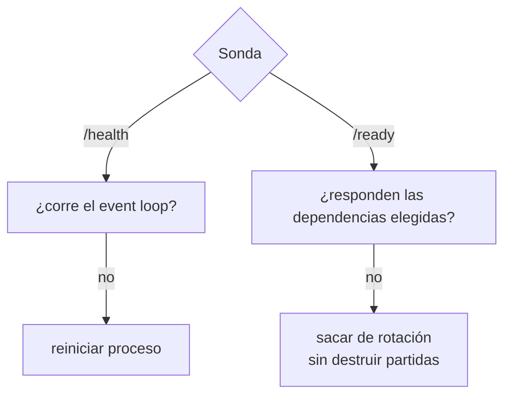
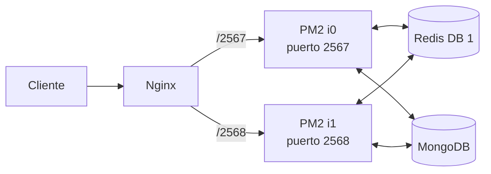
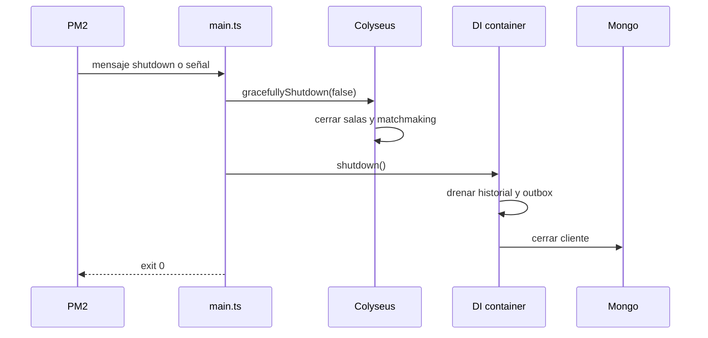

# Operación y despliegue

## Desarrollo local

```bash
cp .env.example .env
npm install
npm run dev
```

`JWT_SECRET` es obligatorio. `INTERNAL_API_KEY` habilita las rutas internas. Mongo, Redis, RabbitMQ
y el backend principal son capacidades opcionales elegidas por la presencia de sus URLs.

Con el stack local completo:

```bash
docker compose up --build
```

## Documentación

```bash
npm run docs:dev      # servidor local con recarga
npm run docs:build    # valida y genera docs/.vitepress/dist
npm run docs:preview  # sirve el build estático
```

## Sondas



`/health` no toca bases. Una dependencia caída no se arregla reiniciando, y reiniciar destruye las
partidas que viven en ese proceso. `/ready` sí consulta cada dependencia, en paralelo y con un plazo
individual de dos segundos.

## Varias instancias

Cada proceso PM2 corre en modo `fork` y escucha en `PORT + NODE_APP_INSTANCE`; la suma la hace
Colyseus dentro de `listen()`. `env.listeningPort` es el puerto efectivo que se anuncia al cliente.



Con más de una instancia, `SERVER_ADDRESS` es obligatorio y Nginx debe rutear WebSocket y HTTP por
el prefijo del puerto anunciado. Sin `REDIS_URL`, dos procesos no forman un clúster aunque ambos
estén escuchando.

## Apagado ordenado



Redis lo cierra Colyseus en el primer paso; cerrarlo otra vez deja rechazos durante el deploy. Un
`kill -9` no ejecuta este flujo: las claves huérfanas desaparecen por TTL.

## Verificación

```bash
npm run typecheck
npm run lint
npm test
npm run build
npm run docs:build
npm run depcruise
```

El smoke real agrega Docker, dos procesos PM2, Nginx, Redis, Mongo y RabbitMQ:

```powershell
$env:RUN_ENGINE_SMOKE='1'; npm run test:deploy; Remove-Item Env:RUN_ENGINE_SMOKE
```

## Despliegue y rollback

CI compila y prueba antes de empaquetar. El workflow de deploy sube un release inmutable, mueve el
symlink `current`, recarga PM2 y consulta `/ready` instancia por instancia. Si falla, repone el
release anterior y conserva el fallo como resultado del pipeline.

En el servidor:

```bash
bash /var/www/Betaso/domino-backend-v2/current/scripts/deploy-remote.sh --rollback
```

Los releases marcados `FAILED` no son candidatos al rollback.
