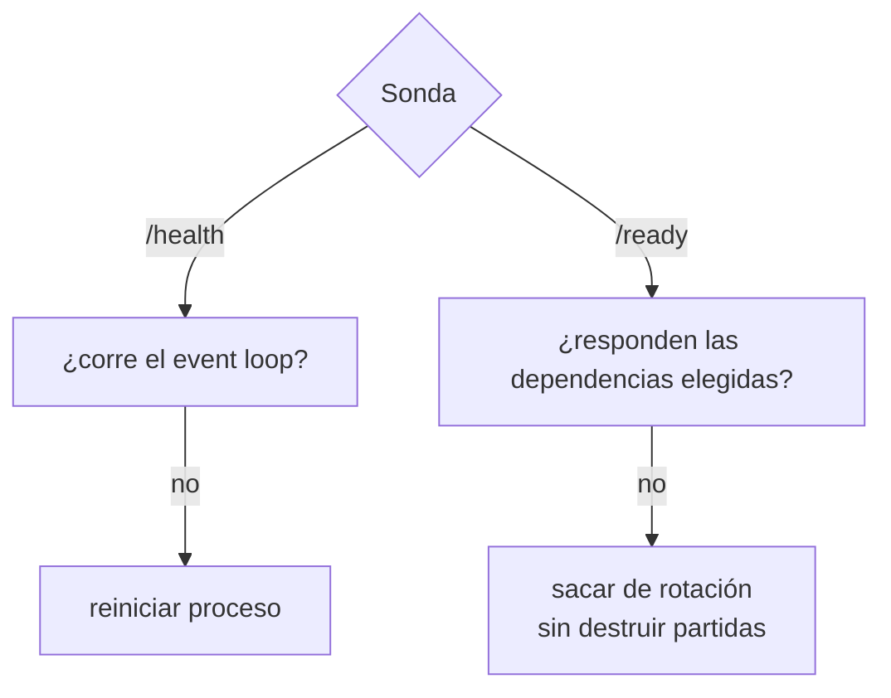
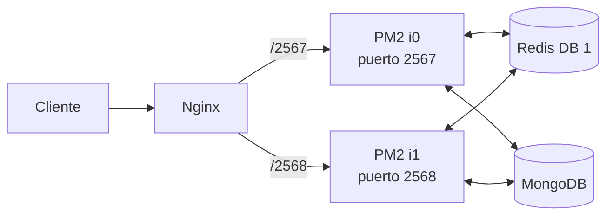
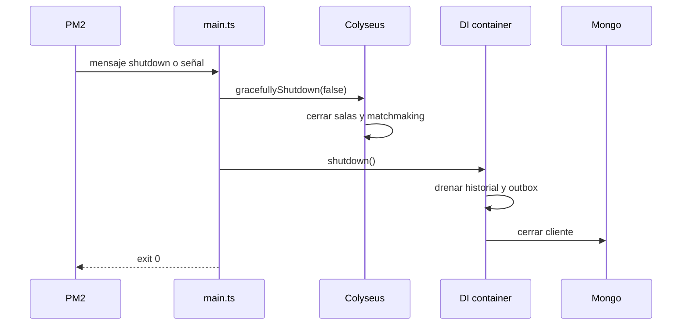

# Operación y despliegue

## Desarrollo local

```bash
cp .env.example .env
npm install
npm run dev
```

`BETASO_BACKEND_JWT_SECRET` es obligatorio. `BETASO_ADMIN_PANEL_API_KEY` (la que nos presenta el panel) habilita las rutas internas; `BETASO_BACKEND_API_KEY` (la que presentamos al backend) habilita torneo, antifraude y niveles de apuesta. `ORCHESTRATOR_API_KEY` (la que presenta el orquestador de Betaso Juegos, mínimo 16 caracteres) habilita `POST /internal/matches` y `POST /internal/players/:userId/seat`; sin ella esas rutas responden 404, y si está el arranque exige `BILLING_AUTH_PUBLIC_KEY` y que no repita ninguna de las otras dos llaves. `BILLING_AUTH_PUBLIC_KEY` es la clave PÚBLICA EC P-256 (PEM en una línea con `\n` literales) con la que se verifican los ES256 de billing-auth; se valida al arrancar y una clave privada se rechaza. Esos tokens deben traer el emisor `JWT_ISSUER` (default `betaso-auth`), la audiencia `JWT_AUDIENCE` (default `domino`) y el claim `game` igual a `\"domino\"`; los HS256 del backend principal siguen valiendo. Mongo, Redis, RabbitMQ
y el backend principal son capacidades opcionales elegidas por la presencia de sus URLs.

Con el stack local completo:

```bash
docker compose up --build
```

## Documentación

```bash
npm run docs:dev      # servidor local con recarga
npm run docs:build    # valida y genera docs/.vitepress/dist
npm run docs:preview  # sirve el build estático
```

## Sondas


```mermaid
flowchart TD
  Probe{Sonda}
  Probe -->|/health| EventLoop["¿corre el event loop?"]
  Probe -->|/ready| Dependencies["¿responden las dependencias elegidas?"]
  EventLoop -->|no| Restart["reiniciar proceso"]
  Dependencies -->|no| Drain["sacar de rotación\nsin destruir partidas"]
```

`/health` no toca bases. Una dependencia caída no se arregla reiniciando, y reiniciar destruye las
partidas que viven en ese proceso. `/ready` sí consulta cada dependencia, en paralelo y con un plazo
individual de dos segundos.

## Varias instancias

Cada proceso PM2 corre en modo `fork` y escucha en `PORT + NODE_APP_INSTANCE`; la suma la hace
Colyseus dentro de `listen()`. `env.listeningPort` es el puerto efectivo que se anuncia al cliente.


```mermaid
flowchart LR
  Client["Cliente"] --> Nginx
  Nginx -->|/2567| P0["PM2 i0\npuerto 2567"]
  Nginx -->|/2568| P1["PM2 i1\npuerto 2568"]
  P0 <--> Redis[("Redis DB 1")]
  P1 <--> Redis
  P0 <--> Mongo[("MongoDB")]
  P1 <--> Mongo
```

Con más de una instancia, `SERVER_ADDRESS` es obligatorio y Nginx debe rutear WebSocket y HTTP por
el prefijo del puerto anunciado. Sin `REDIS_URL`, dos procesos no forman un clúster aunque ambos
estén escuchando.

## Apagado ordenado


```mermaid
sequenceDiagram
  participant PM2
  participant Main as main.ts
  participant Server as Colyseus
  participant Container as DI container
  participant Mongo

  PM2->>Main: mensaje shutdown o señal
  Main->>Server: gracefullyShutdown(false)
  Server->>Server: cerrar salas y matchmaking
  Main->>Container: shutdown()
  Container->>Container: drenar historial y outbox
  Container->>Mongo: cerrar cliente
  Main-->>PM2: exit 0
```

Redis lo cierra Colyseus en el primer paso; cerrarlo otra vez deja rechazos durante el deploy. Un
`kill -9` no ejecuta este flujo: las claves huérfanas desaparecen por TTL.

## Verificación

```bash
npm run typecheck
npm run lint
npm test
npm run build
npm run docs:build
npm run depcruise
```

El smoke real agrega Docker, dos procesos PM2, Nginx, Redis, Mongo y RabbitMQ:

```powershell
$env:RUN_ENGINE_SMOKE='1'; npm run test:deploy; Remove-Item Env:RUN_ENGINE_SMOKE
```

## Despliegue y rollback

Es el mismo estilo que billing-auth y el orquestador en games-orchestrator, portado y acoplado al
dominó: `.github/workflows/ci-cd.yml` y `scripts/deploy/`.

| Rama | Entorno |
| --- | --- |
| `develop` | dev |
| `stage` | stage |
| `main` | prod |

Un PR o un push a otra rama solo verifica. `workflow_dispatch` despliega desde **cualquier** rama al
entorno que se elija: así se prueba una feature en dev sin mergearla.

El workflow tiene estos jobs:

- **`target`:** elige el entorno y el medio.
- **`verify`:** typecheck, lint, tests (incluidos los de `scripts/deploy`), build y empaquetado.
- **`smoke`:** la certificación con Docker, PM2 y Nginx.
- **`image`:** la imagen `runtime`, construida siempre.
- **`docs`:** el sitio de docs.
- **`deploy`:** espera a todos los anteriores. Sube el release, corre en el servidor el script que viaja
  adentro y comprueba `PUBLIC_URL/health` **desde el servidor** (Cloudflare le contesta 403 a los runners
  de GitHub).

### En el servidor

```
/var/www/Betaso/domino-backend-v2/
├── shared/.env          el entorno real; se crea una vez a mano y el despliegue nunca lo toca
├── shared/deploy.env    cómo se desplegó la última vez (lo escribe el despliegue)
├── releases/<id>/       el artefacto; se conservan el que corre y el anterior
├── current ──► releases/<id>
├── logs                 ./logs, ./logs --lines 200 --nostream
├── restart              recrea el proceso sin cambiar de versión
└── rollback             vuelve al release anterior, sin argumentos
```

`/ready` se consulta instancia por instancia, y el despliegue mira qué release corre de verdad
(`/proc/<pid>/cwd` con pm2, o la imagen del contenedor con Docker). Si el release nuevo no queda sano,
vuelve solo al anterior, marca el nuevo con `FAILED` y el pipeline queda en rojo. Los releases marcados
`FAILED` no son candidatos al rollback. **El rollback vuelve el código**: lo que ya se escribió en Mongo,
Redis o RabbitMQ se queda.

### Medios

`DEPLOY_MODE` (variable del repositorio, o el input `mode` del dispatch) elige el medio:

- **`pm2`** (por defecto): el bundle y `npm ci --omit=dev`, con las dependencias reusadas si el lockfile
  y el node no cambiaron.
- **`docker`:** la imagen la construye el CI y viaja por scp.
- **`docker-build`:** la imagen la construye el servidor.

Con Docker corre el servicio `domino-server` de `compose.yaml` (perfil `server`), en **una sola
instancia**: Mongo, Redis y RabbitMQ son los del servidor, con `host.docker.internal` en el `.env`.

Para **cambiar de medio**, se baja a mano el que corre y después se despliega con el otro. Los scripts se
niegan a arrancar mientras el otro medio esté sirviendo, porque usan el mismo puerto:

- de pm2 a Docker: `pm2 delete <APP_NAME>`;
- de Docker a pm2: `docker compose -p <APP_NAME> down`.

### Configuración en GitHub

**Del repositorio:** `DEPLOY_ENVIRONMENTS` (hoy `dev`) y `DEPLOY_MODE`.

**Del Environment de cada entorno** (`dev`, `stage`, `prod`):

| Nombre | Tipo | Qué es |
| --- | --- | --- |
| `SSH_HOST`, `SSH_USER`, `SSH_KEY` | secreto | El acceso por ssh |
| `SSH_KNOWN_HOSTS` | variable | La clave del host, fijada |
| `DEPLOY_PATH` | variable | `/var/www/Betaso/domino-backend-v2` |
| `APP_NAME` | variable | `domino-backend-v2-dev` |
| `INSTANCES` | variable | Cuántas instancias |
| `NODE_BIN`, `NODE_INTERPRETER` | variable | El node 22 de nvm: el pm2 del VPS corre con el 20 del sistema |
| `PUBLIC_URL` | variable | `https://backend-dev-domino-game-v2.elbetaso.com` |

### Preparar un servidor la primera vez

1. Crear `DEPLOY_PATH/shared/.env` a partir de `.env.example`. En dev:
   - `PORT=2571` y `APP_ENV=dev`;
   - las llaves (`ORCHESTRATOR_API_KEY`, la misma que `DOMINO_API_KEY` del orquestador) y
     `BILLING_AUTH_PUBLIC_KEY`;
   - `MONGO_URI` (el Mongo del VPS escucha en `:27018`);
   - `REDIS_URL`, con un índice propio;
   - `RABBITMQ_URL`.
2. Crear el vhost del dominio hacia `127.0.0.1:PORT`, con el `RewriteRule … ws://` del upgrade de
   WebSocket.
3. Cargar en GitHub las variables y los secretos de arriba, y sumar el entorno a `DEPLOY_ENVIRONMENTS`.

En dev, el dominó **v1** (`domino-backend-dev`, `:2567`, `backend-dev-domino-game.elbetaso.com`) sigue
corriendo en `/opt/domino-backend/development`. Este no lo toca.
